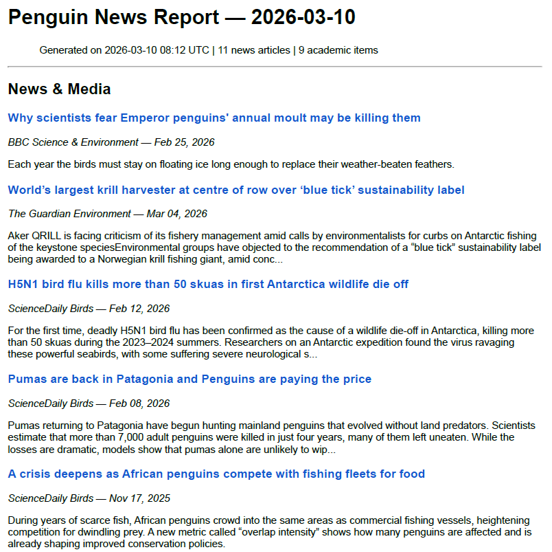

# RSSPenguin

Daily penguin news aggregator. Pulls from free RSS feeds, filters for penguin-related content, commits a Markdown report to this repo, and emails it via Brevo.

## How it works

1. GitHub Actions triggers daily at 08:00 UTC
2. `main.py` fetches articles from RSS feeds in `config/sources.yaml`
3. Articles are filtered by penguin-related keywords
4. A Markdown report is saved to `reports/YYYY-MM-DD.md` and committed
5. The report is emailed to you via Brevo


## Setup

### 1. Fork / clone this repo to your GitHub account

### 2. Get a Brevo API key
- Sign up at https://brevo.com (free tier: 300 emails/day)
- Go to SMTP & API → API Keys → Generate a new API key
- Verify your sender email under Senders & IP

### 3. Add GitHub Secrets
Go to your repo → Settings → Secrets and variables → Actions → New repository secret

| Secret name | Value |
|---|---|
| `BREVO_API_KEY` | Your Brevo API key |
| `TO_EMAIL` | Email address to receive reports |
| `FROM_EMAIL` | Your verified Brevo sender email |

### 4. Enable GitHub Actions
Go to the Actions tab and enable workflows if prompted.

### 5. Test manually
Go to Actions → Daily Penguin News Report → Run workflow


## Local development

```bash
pip install -r requirements.txt

# Create a .env file
echo "BREVO_API_KEY=your_key" >> .env
echo "TO_EMAIL=you@example.com" >> .env
echo "FROM_EMAIL=verified@example.com" >> .env

python main.py
```

## Customize

- Add/remove RSS feeds: edit `config/sources.yaml`
- Add/remove keywords: edit the `keywords` list in `config/sources.yaml`
- Change schedule: edit the cron expression in `.github/workflows/daily-report.yml`

### Some Supported Information Sources
The system tracks penguin-related content from various information sources including:
- Scientific research journals and publications
- Wildlife conservation organization blogs and news
- Zoological institution updates and press releases
- Environmental news websites and RSS feeds
- Academic institution research announcements
- Wildlife photography and nature blogs
- Penguin conservation project updates
- Marine biology research feeds
- Climate change and environmental science news
- Antarctic and sub-Antarctic research station reports

Content is filtered using comprehensive penguin-related keywords covering all major species, conservation terms, and research topics.

## Reports

Daily reports are stored in `reports/YYYY-MM-DD.md`.

### Email Output Example

Here's an example of what the daily email report looks like:



## Subscribe to Daily Reports

Want to receive daily penguin news reports directly in your inbox? 

🐧 [Register your email here](https://www.kdocs.cn/l/cfPogvdbLDZL)

I'll add you to my mailing list and send the curated penguin news report to you daily!

## Suggesting New Sources

Have a great source of penguin news that I haven't included yet? 

I'd love to hear about it! Please [submit a suggestion](https://www.kdocs.cn/l/cgZfqRwNJPkR) and I'll add it to the list.