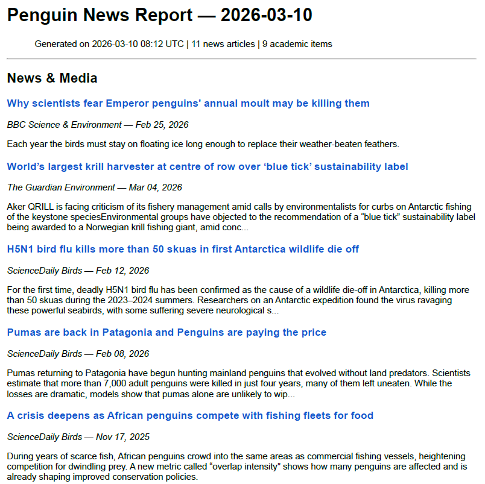

# RSSPenguin

English | [简体中文](#rsspenguin---每周企鹅新闻聚合器)

Weekly penguin news aggregator. Pulls from free RSS feeds, filters for penguin-related content, commits a Markdown report to this repo, and emails it via Brevo.

## How it works

1. GitHub Actions triggers weekly at 08:00 UTC each Monday
2. `main.py` fetches articles from RSS feeds in `config/sources.yaml`
3. Articles are filtered by penguin-related keywords
4. A Markdown report is saved to `reports/YYYY-MM-DD.md` and committed
5. The report is emailed to you via Brevo


## Setup

### 1. Fork / clone this repo to your GitHub account

### 2. Get a Brevo API key
- Sign up at https://brevo.com (free tier: 300 emails/day)
- Go to SMTP & API → API Keys → Generate a new API key
- Verify your sender email under Senders & IP

### 3. Add GitHub Secrets
Go to your repo → Settings → Secrets and variables → Actions → New repository secret

| Secret name | Value |
|---|---|
| `BREVO_API_KEY` | Your Brevo API key |
| `BREVO_LIST_ID` | Your Brevo contact list ID (e.g., 2) |
| `TO_EMAIL` | Email address to receive reports |
| `FROM_EMAIL` | Your verified Brevo sender email |

### 4. Enable GitHub Actions
Go to the Actions tab and enable workflows if prompted.

### 5. Test manually
Go to Actions → Weekly Penguin News Report → Run workflow


## Local development

```bash
pip install -r requirements.txt

# Create a .env file
echo "BREVO_API_KEY=your_key" >> .env
echo "TO_EMAIL=you@example.com" >> .env
echo "FROM_EMAIL=verified@example.com" >> .env

python main.py
```

## Customize

- Add/remove RSS feeds: edit `config/sources.yaml`
- Add/remove keywords: edit the `keywords` list in `config/sources.yaml`
- Change schedule: edit the cron expression in `.github/workflows/daily-report.yml`

### Some Supported Information Sources
The system tracks penguin-related content from various information sources including:
- Scientific research journals and publications
- Wildlife conservation organization blogs and news
- Zoological institution updates and press releases
- Environmental news websites and RSS feeds
- Academic institution research announcements
- Wildlife photography and nature blogs
- Penguin conservation project updates
- Marine biology research feeds
- Climate change and environmental science news
- Antarctic and sub-Antarctic research station reports

**Note**: You can find a complete list of RSS feeds in [feeds.csv](feeds.csv).

Content is filtered using comprehensive penguin-related keywords covering all major species, conservation terms, and research topics.

## Reports

Weekly reports are stored in `reports/YYYY-MM-DD.md`.

### Email Output Example

Here's an example of what the weekly email report looks like:



## Subscribe to my Weekly Reports

Want to receive my weekly penguin news reports directly in your inbox? 

🐧 [Register your email here](https://www.kdocs.cn/l/cfPogvdbLDZL)

I'll add you to my mailing list and send the curated penguin news report to you weekly!

## Suggesting New Sources

Have a great source of penguin news that I haven't included yet? 

I'd love to hear about it! Please [submit a suggestion](https://www.kdocs.cn/l/cgZfqRwNJPkR) and I'll add it to the list.

---

# RSSPenguin - 每周企鹅新闻聚合器

[English](#rsspenguin) | 简体中文

每周企鹅新闻聚合器。从免费RSS源拉取内容，过滤企鹅相关新闻，将Markdown报告提交到本仓库，并通过Brevo发送邮件。

## 工作原理

1. GitHub Actions 每周一 UTC 时间 08:00 自动触发
2. `main.py` 从 `config/sources.yaml` 中的RSS源获取文章
3. 文章通过企鹅相关关键词进行过滤
4. Markdown报告保存到 `reports/YYYY-MM-DD.md` 并提交
5. 报告通过Brevo发送到您的邮箱

## 安装设置

### 1. Fork/克隆本仓库到您的GitHub账户

### 2. 获取Brevo API密钥
- 在 https://brevo.com 注册（免费层：每天300封邮件）
- 转到 SMTP & API → API密钥 → 生成新API密钥
- 在"发件人&IP"下验证您的发件人邮箱

### 3. 添加GitHub Secrets
转到您的仓库 → Settings → Secrets and variables → Actions → New repository secret

| 密钥名称 | 值 |
|---|---|
| `BREVO_API_KEY` | 您的Brevo API密钥 |
| `BREVO_LIST_ID` | 您的Brevo联系人列表ID (例如: 2) |
| `TO_EMAIL` | 接收报告的邮箱地址 |
| `FROM_EMAIL` | 您验证过的Brevo发件人邮箱 |

### 4. 启用GitHub Actions
转到Actions标签页，如果提示则启用工作流。

### 5. 手动测试
转到 Actions → Weekly Penguin News Report → Run workflow

## 本地开发

```bash
pip install -r requirements.txt

# 创建.env文件
echo "BREVO_API_KEY=your_key" >> .env
echo "TO_EMAIL=you@example.com" >> .env
echo "FROM_EMAIL=verified@example.com" >> .env

python main.py
```

## 自定义

- 添加/删除RSS源：编辑 `config/sources.yaml`
- 添加/删除关键词：编辑 `config/sources.yaml` 中的 `keywords` 列表
- 更改计划：编辑 `.github/workflows/daily-report.yml` 中的cron表达式

### 支持的信息源
系统从各种信息源跟踪企鹅相关内容，包括：
- 科学研究期刊和出版物
- 野生动物保护组织博客和新闻
- 动物园机构更新和新闻稿
- 环境新闻网站和RSS源
- 学术机构研究公告
- 野生动物摄影和自然博客
- 企鹅保护项目更新
- 海洋生物学研究源
- 气候变化和环境科学新闻
- 南极和亚南极研究站报告

**注意**: 您可以在 [feeds.csv](feeds.csv) 中找到完整的RSS源列表。

内容使用全面的企鹅相关关键词进行过滤，涵盖所有主要物种、保护术语和研究主题。

## 报告

每周报告存储在 `reports/YYYY-MM-DD.md`。

### 邮件输出示例

以下是每周邮件报告的外观示例：


## 订阅我的每周报告

想直接在收件箱中接收本项目生成的每周企鹅新闻报告吗？

🐧 [在此登记您的邮箱](https://www.kdocs.cn/l/cfPogvdbLDZL)

我会将您添加到我的邮件列表中，并每周为您发送精选的企鹅新闻报告！

## 推荐新来源

如果您有本项目尚未包含的企鹅新闻来源，欢迎推荐！

请[提交建议](https://www.kdocs.cn/l/cgZfqRwNJPkR)，我会将其添加到列表中。